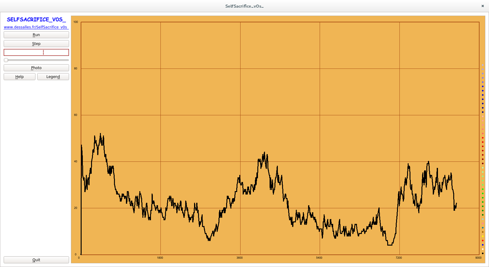
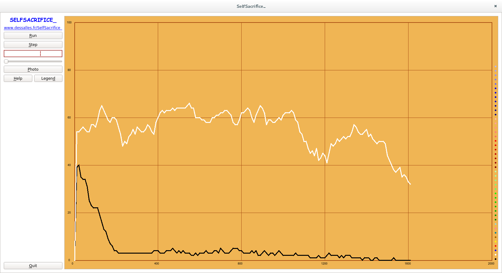

Self-sacrifice
===========================

Throughout history, people have been willing to lay down their lives for the sake of their groups or ideology (for a review, see [Whitehouse, 2018](https://www.ncbi.nlm.nih.gov/pubmed/29409552)). Whether hailed as heroes or reviled as terrorists, 'self-sacrifiers' are generally young, ambitious male adults. Put together, these facts seem to underlie the incompleteness of proximal explanations (e. g. in terms of the contents of a specific ideology) and the inadequateness of a 'pathological' vision of self-sacrifice (whereby self-sacrifice results from unadaptive behavior and/or from miscalculations).

Could self-sacrifice therefore have a biological function? This project sets the groundwork for investigating the (individual) biological motivations that may underlie self-sacrifice (which need not coincide with its moral motivations, potentially geared towards the collective), following a costly social signal model (e. g. [Dessalles, 2014](https://onlinelibrary.wiley.com/doi/full/10.1111/evo.12378)). Social signals are meant to attract friends; in cases where the signaled quality correlates with the audience's fitness, such a quality will be in social demand and signaling can therefore bring benefits in terms of social status.

However, in the case of self-sacrifice, signalers do not survive to enjoy these potential benefits. An additional hypothesis is needed - we propose that social status be in part inherited. And, to explain why a martyr's children may be in social demand, we propose another additional hypothesis - namely that individuals may want to signal their patriotism by honoring heroes, which may 'spill over' to their descendants (see [Actual scenario](#actual-scenario) for more details).

We program two scenarios, using [Evolife](https://evolife.telecom-paristech.fr/). A simplified scenario establishes the initial framework of the study. A second scenario builds on this base, aiming for a plausible explanation of self-sacrifice.

<!-- markdown-toc start - Don't edit this section. Run M-x markdown-toc-refresh-toc -->
**Table of Contents**

[Self-Sacrifice](#self-sacrifice)
  - [How to launch](#how-to-launch)
  - [Evolife](#evolife)
  - [Base scenario](#base-scenario)
    - [1 Initializations](#1-initializations)
    - [2 Sacrifices](#2-sacrifices)
        - [2a Individual propensity to self-sacrifice](#2a-individual-propensity-to-self-sacrifice)
        - [2b Population-level self-sacrifice game](#2b-population-level-self-sacrifice-game)
    - [3 Social interactions](#3-social-interactions)
    - [4 Computing scores](#4-computing-scores)
    - [Base simulation output](#base--simulation-output)
  - [Actual scenario](#actual-scenario)
    - [2 Changes to sacrifices](#2-changes-to-sacrifices)
    - [3 Changes to social interactions](#3-changes-to-social-interactions)
    - [4 Changes to computing scores](#4-changes-to-computing-scores)
    - [Actual simulation output](#actual-simulation-output)
  - [Initial attempts](#initial-attempts)
    - [Social game](#social-game)
    - [Evolife scenario](#scenario)
  - [Conclusion](#conclusion)
  - [Commentaires](#commentaires)

<!-- markdown-toc end -->

## How to launch

In order to launch, you need to (pull and) go to the `Evolife` folder. If you are on Linux or Unix, launch `first.py` from that folder the first time you use Evolife, then go to the `Other/SelfSacrifice` folder. From there, type `./starter` in a terminal, to open Evolife's configuration editor.

On Windows, you don't need to do `first.py`; the editor is launched using `Starter.bat`.

From the configuration editor, you can load two .evo configuration files, which contain the parameters of the two scenarios implemented under: `SelfSacrifice_v0.evo` ('Base') and `SelfSacrifice.evo` ('Actual'). These configuration files, as well as their corresponding scripts are replicated directly at the root of the repository.

Once one is loaded, the corresponding scenario is initiated by clicking on `Run`. This opens a window display from where, by default, you can view the average value of genes in a population over time (normalized to 100), as well as the the actual value of the binary vectors representing genes in the population (by clicking on `Genome`).

You can also launch other Evolife functionalities, by going to the correct location and launching the configuration editor.

## Evolife

Evolife has been developed by Jean-Louis Dessalles in order to study various evolutionary phenomena. It is written in Python, and can be downloaded [here](https://evolife.telecom-paristech.fr/Evolife.zip).

The core of Evolife is a genetic algorithm. An individual's behavior is controlled by a binary vector (genome). Individuals live, reproduce sexually, and gain points in a life game (see under).

Evolife implements two modes of selection:
    - Ranking, whereby individuals are ranked according to their score and are granted a number of potential children that is a in increasing function of their rank - whose sloped is controlled by the `Selectivity` parameter.
    - Differential Death, whereby score lead to life points that protect them from life hazards, thus increasing their life expectancy (and opportunities to reproduce) - relative gains are controlled by the `SelectionPressure` parameter.

While ranking allows for faster convergence, differential death seems more realistic - and will be the subsequent preferred mode of selection (with ranking, having 1 000 001 points is significantly better than having 1 000 000)

The code is organized in separated modules - a complete description, including of how to launch Evolife is available on the [site](https://evolife.telecom-paristech.fr). A scenario such as the two written here, inherits from `Default_Scenario`. However, simply rewriting its functions does not allow to modify individuals, as will prove useful in our scenarios (adding a selfSacrifice boolean for instance) - see [Evolife scenario](#evolife-scenario) for a failed attempt. Another (initial) attempt unsuccessfully implemented a purely [Social game](#social-game), where individuals did not inherit from Evolife's  `Individual` module - and hence did not inherit from  `Genes `.

## Base scenario

In this simplified scenario, we suppose that admiration of martyrs is a social given (controlled by an `Admiration` parameter) - meaning that we will not implement the second-order signal here (see [Actual scenario](#actual-scenario)).

Instead, self-sacrifice of individuals leads to competition for this exogenous version of social admiration. This does not benefit the martyrs (who die), but can benefit their children, who indirectly benefit from their ascendant being admired.

The base scenario is implemented in `SelfSacrifice_v0.py`.

The core of the script is the `life_game` function which is where individuals in a population acquire their score. It is launched every year.

    # Life_game
    """ Defines one year of play (outside of reproduction)
    		This is where individual's acquire their score
    """
    # First: make initializations (1)
    self.start_game(members)
    # Then: play multipartite game (2)
    self.sacrifices(members, self.Parameter('MaxHeroes')) 	# (2a) Decides who will self-sacrifice
    self.interactions(members, self.Parameter('Rounds'))	# (2b) Social interactions
    # Last: work out final tallies (3)
    for indiv in members:
      self.evaluation(indiv)
    # Scores are translated into life points, which affect individual's survival
    self.lives(members)

The annual life game is thus structured following three steps.

### 1 Initializations

First, important individual variables are reset. Individuals inherit basic characteristics from Evolife's `Individual` module, including the structure of their genes. In this case, an individual's genome is comprised of one gene named `SelfSacrifice` whose value will affect that individual's propensity to self-sacrifice for the group (see [(2 Sacrifices](#2-sacrifices)). The gene is given at birth and so will not be reinitialized here. Individual's also have a `Descendants` attribute, which lists all their descendants - and is not reinitialized either.

Other individual attributes pertaining to the scenario are however reinitialized each year, using `start_game`. These are:
  - A `selfSacrifice` attribute, which is a boolean (reset to False). It is True when an individual 'decides' to self-sacrifice (see [2-sacrifices](#2-sacrifices)]).
  - An `Admiration` parameter, which represents how much admiration society gives the individual if and when he opts for martyrdom.
  - A `score()` attribute, which keeps track of his score.

### 2 Sacrifices
The life game actually begins with sacrifices. This is the crux of this base scenario, where social interactions have no effect.

#### 2a Individual propensity to self-sacrifice

An individual's propensity to self-sacrifice for the group is controlled by his `SelfSacrifice` gene; `deathProbability` converts that gene's value into a number between 0 and 1. Self-sacrifice is only possible from a certain age (controlled by `SacrificeMaturity`).
We propose two 'modes':
    - One 'probabilistic', where a individual's probability of martyrdom is the result of deathProbability.
    - One 'binary', whereby having any non null value for the gene leads to martyrdom.

Because long-term gene levels in the population are the fruit of reproductive dynamics, and in order to avoid bugs associated with every individual in a population dying at once, we propose that individuals who self-sacrifice not actually 'die' - but be excluded from reproduction that year. The cost of the signal is thus measured in terms of lost reproductive potential. Individuals who don't have the gene (have a null value) will not face any cost in this base scenario.

#### 2b Population-level self-sacrifice game

This stage is implemented using three python function: sacrifices, honoring and pantheon. The first implements self-sacrifice decisions at the population level:

    # sacrifices
    def sacrifices(self, members, max_heroes=100):
  		""" Self-sacrifice 'game':
  			Heroes may self-sacrifice "for the good of the group"
  			In return they are admired - admiration is exogenous here
  			Used in 'life_game'
  		"""
  		Heroes = []
  		Cowards = members[:]
  		for i in range(min(max_heroes,len(members))):
  			Potential_Hero = choice(Cowards)
  			if self.selfSacrifice(Potential_Hero):
  				Heroes.append(Potential_Hero)
  				Cowards.remove(Potential_Hero)
  		# In return, heroes are honored (admired) by society
  		self.honoring(Cowards, Heroes)

`Honoring` calls `pantheon` with a local `social_admiration` variable, which represents the total amount of admiration that is 'available' for heroes (to compete over). In this base scenario, this is a given (and is the product of an `Admiration` parameter and total population size).

'Competition' between heroes for social admiration is defined by `pantheon`. Degree of competition depends on a `HeroCompetivity` parameter (0: egalitarian pantheon; 100: winner-takes-all; anything in between: geometric repartition).

    # pantheon
    def pantheon(self, heroes, social_admiration = 0, competivity_ratio = 100):
  		""" Heroes 'compete' for admiration
  			(They have no control over which share of the pie they will receive)
  			Used in 'honoring'
  		"""
  		if not heroes:
  			return
  		equa = 1 - competivity_ratio / 100.0
  		if equa == 1:	# The pantheon is equalitarian
  			tot_weights = len(heroes)
  		elif equa >= 0 and equa < 1:
  			tot_weights = (1-(equa)^len(heroes)) / (1 - equa)	# Geometric sum (python power symbol gave an error with markdown)
  		else:
  			error('competivity_ratio must be between 0 and 100')
  		best_weight = 1 / tot_weights
  		for Hero in heroes:
  			Hero.Admiration = best_weight * social_admiration
  			best_weight = equa * best_weight

### 3 Social interactions

Interactions between members of society are implemented using `interactions`:

    # interactions
    """	Defines how the (alive) population interacts
      Used in 'life_game'
    """
    for Run in range(nb_interactions):
      Fan = choice(members)
      # Fan chooses friends from a sample of Partners
      Partners = self.partners(Fan, members, int(percent(self.Parameter('SampleSize')\
                                  * (self.Parameter('PopulationSize')-1) )))
      self.interact(Fan, Partners)

For as many `Rounds` as defined by a parameter, a random individual is chosen to interact with a group of individuals, selected by `partners` - which returns a random sample by default (whose size is controlled by `SampleSize`). Individuals then `interact` with this sample of partners - in this base scenario, `interact` is empty, as social interactions are taken to have relevant effect.

NB: I just realized that social interactions include dead heroes... which I need to correct. I don't know how much this affect the outcomes... In the [Actual scenario](#actual-scenario), while individual's should preferentially chose alive people (actual signalers), they may form bonds with dead individuals...

### 4 Computing scores

Scores are calculated at the end of the year. Here, the only reason to gain points is through a parents' (or more largely ascendants') sacrifice. This is done through `spillover`. What a descendant can potentially gain depends on how much his ascendant hero was admired (stored in `hero.admiration`) and how much admiration spills over to descendants in general (controlled by `SacrificeHeredity`; the rest is 'lost' for descendants). In addition, what a particular descendant actually gains will depend on how many other descendants there are, on how far away in the family tree he or she is (more for children than grand-children...) and on repartition between generations (controled by `KinSelection`).

    # spillover
    def spillover(self, Hero, admiration = 0, kin_transfer = 0.5):
      """ A hero's descendants benefit from his or her sacrifice,
        proportionally to how much he or she is honored / admired
        and depending on how close they are to the hero in the family tree
        Used in 'evaluation'
      """
      tot_benef = percent(admiration * self.Parameter('SacrificeHeredity'))
      # Some admiration is 'lost' for descendants (the goat is eaten without them, people they will never meet talk about the heroes' values...)
      if not Hero.Descendants:
        return	# Hero has no descendants for 'admiration' to spillover to
      tot_weights = 0
      for (Desc, gen) in Hero.Descendants:
        tot_weights += (kin_transfer)^gen
      for (Desc, gen) in Hero.Descendants:
        share = (kin_transfer)^gen	# share is coefficient of relatedness by default (depends on the 'KinSelection' parameter)
        Desc.score(+ share / tot_weights * tot_benef)

### Base simulation output

Launching this scenario in 'binary' mode from the configuration editor (see [How to launch](#how-to-launch)) yields the following:

Contrarily to what would be expected for this mode, the gene does not seem to be heading to fixation one way or the other. Statistical analyses in either mode were not performed.

## Actual scenario

Admiration is no longer exogenous and will depend on the (alive) crowd's signaling of its patriotism. The idea is the following: in a certain context, such as intergroup conflict, selecting friends who are committed to the group may become crucial. If you make a mistake and befriend someone who is sympathetic to the other group, you may lose from their undecidedness in the face of danger - or worse, you may even be betrayed (denounced) at the moment of reckoning (e. g. the end of the war). Concurrent with the idea of a moment of reckoning, you own commitment will be questioned by the group and you would benefit from having a truly committed (i. e. verifiably patriotic) friend.

Together, these create a theoretical impetus to signal one's patriotism to others in order to attract friends. In turn, this makes it more 'interesting' (for one's genes) to self-sacrifice: signaling one's patriotism is a second-order signal; both are expected to be mutually reinforcing in specific conditions such as dire intergroup conflict.

In order to implement this, individuals are given an additional `Honoring` gene, which controls their investment in the second-order signal, and a `Patriotism` phenotype, which will define how much they are committed to the group (see under). Finally, a `SignalLevel` variable attribute stocks how much they invest in honoring heroes for a given year (and is reinitialized every year).

The basic structure of life_game is not changed.

### (2) Changes to sacrifices

Only `honoring` is changed with respect to before: total social admiration is not given, but will depends on how much a population invests in honoring heroes - which is controlled by their `Honoring` gene.

    # honoring
    def honoring(self, patriots, heroes):
      """ 'Endogenous' honoring of heroes
        Total social admiration directed at heroes now depends on
        the propensity of (alive) individuals to signal their patriotism
        which is controlled by a gene
        Used in 'sacrifices'
      """
      Offerings = 0
      for Patriot in patriots:
        offering = Patriot.gene_value('Honoring')
        # An individual gives (his time, a valuable object, a goat...) proportionally to his or her genes
        Patriot.SignalLevel += offering
        # By doing so, a patriot signals his/her patriotism to others, which they will take into account when choosing friends
        Offerings += offering
      self.pantheon(heroes, Offerings, self.Parameter('HeroCompetivity'))

### (3) Changes to social interactions

Only `interact` changes with respect to before. Members (theoretically all alive... sorry again) of the population select friends according to their displayed patriotism that year - stocked in `SignalLevel`.

    # interact
    def interact(self, indiv, Signalers):
      """ Formation of friendship bonds
        By honoring heroes (see 'honoring'), individuals signal their patriotism
        This signal is used by others to choose their friends
        (keeping in mind this is crucial: see 'evaluation')
      """
      if Signalers == []:	return
      # The agent chooses the best available Signaler from a sample.
      OldFriend = indiv.best_friend()
      Signalers.sort(key=lambda S: S.SignalLevel, reverse=True)
      for Signaler in Signalers:
        if Signaler == indiv:	continue
        if OldFriend and OldFriend.SignalLevel >= Signaler.SignalLevel:
          break	# no available interesting signaler
        if Signaler.followers.accepts(0) >= 0:
          # cool! Self accepted as fan by Signaler.
          if OldFriend is not None and OldFriend != Signaler:
            indiv.G_quit_(OldFriend)
          indiv.F_follow(0, Signaler, Signaler.SignalLevel)
          break

### (4) Changes to computing scores

Changes are implemented in `evaluation`:

    # evaluation
    def evaluation(self, indiv):
      indiv.score(- self.costSignal(indiv))
      if indiv.SelfSacrifice:
        self.spillover(indiv, indiv.Admiration, percent(self.Parameter('KinSelection')))
      " It's the end of the war: friends reveal themselves for who they really are "
      for Friend in indiv.friends.names():
        print(Friend.Patriotism)
        if Friend.Patriotism < percent(self.Parameter('Traitors') x self.Parameter('PopulationSize')):
          # Friend is a traitor who sells you out
          indiv.score(- self.Parameter('DenunciationCost'))
        if Friend.Patriotism > percent(self.Parameter('Patriots') x self.Parameter('PopulationSize')):
          # Friend is a true patriot who can vouch for you
          indiv.score(+ self.Parameter('FriendshipValue'))
      indiv.detach()	# indiv quits his/her friends

This implements the type of intergroup conflict day of reckoning situation imagined above: a proportion of the population is comprised of traitors (controlled by a `Traitors` parameter), who will denounce you (to a potentially huge `DenunciationCost`). Others are true patriots (`Patriots`), who can vouch for you if you are luck enough to count them in your friends (earning you `FriendshipValue` points).

In addition, the cost paid by individuals in honoring heros is substracted from their score, using `costSignal`.

## Initial attempts

### Social game

My first try was to implement a fully 'social' game (where dynamics follow social learning, not genetic evolution). It is contained in `Old/FirstTry_SSim/` - including a detailed README file.

### Evolife scenario

When I understood I would need genes, I attempted to implement an actual Evolife scenario - using only `Defauly_Scenario`. However this did not allow to modify individual's attributes (to include their descendants, the SelfSacrifice boolean..), except by cheating (modifying the Individual module) - so I quickly gave this up.

### Actual simulation output

Launching this scenario from the configuration editor (see [How to launch](#how-to-launch)) yields the following:

The average value of Honoring appears to quickly drop to 0 - even with seemingly huge cost/benefits associated to the day of reckoning situation (see `SelfSacrifice.evo` for Parameter values). Strangely, contrarily to what would be expected, the average value of SelfSacrifice does not follow suit (probably - or hopefully - for the same reasons that made the results of Base weird).

## Conclusion

Although I lost a lot of time initially, discovering Evolife (and Python more largely), this  project allowed me to build an initial framework for my future study of self-sacrifice (for my Semester 2 internship) - and a better understanding of the tools I will need to master.

As seen with the example of interactions with dead people (see [3 Social interactions](#3-social-interactions)), I am still discovering new problems every day - which means I'm learning, I guess :). I have not had time to analyze my simulation results: for now, as evoked in [Base simulation output](#base-simulation-output) and [Actual simulation output](#actual-simulation-output), they seem too weird to begin any king of statistical analysis before debugging. I am still unclear on the mathematics behind the games faces by agents, notably the actual cost of self-sacrifice.

## Commentaires
Niveau personnel avant le cours: ingénieur de formation, je pense que je partais avec pas mal d'avance en termes de logique de codage (ou juste maths), même si la dernière fois où j'avais codé, c'était sur papier et pour le concours de classe prépa maths de 2010 (en CamL - on faisait aussi un peu de MatLab). Bizarrement avant cette année je m'étais tenu éloigné de tout ce qui était informatique, pensant d'abord que ça m'intéressait pas, puis que c'était 'trop tard'.

Le cours m'a beaucoup apporté - déjà en termes de temps disponible et motivation supplémentaire pour aller creuser Evolife et Python - il n'y a pas si longtemps, coder quelque chose dedans me semblait dantesque, et il a fallu pas mal de temps pour avancer à tâtons en copiant-collants des bouts sans trop comprendre / jouant des jeux de pistes à multiples modules pour arriver à un petit quelque chose. D'où aussi les deux exemples 'ratés' donnés.

J'ai aussi beaucoup apprécié le site automatetheboringstuff, et les quelques exos qu'on a fait en début d'année - d'abord, pour voir que j'étais capable de faire plein de trucs (ça m'a fait rigoler de retrouver des problèmes qu'on pouvait aborder en Sup genre trouver des nombres premiers), et ensuite, pour envisager tous les bénéfices liés à la maîtrise de l'outil informatique (même si ça fait longtemps que je ne suis pas retourné sur ce site). Par contre, les cours ne m'ont pas autant servi, le rythme était un peu lent pour moi et les exemples pris trop 'expérimentaux' (mais c'est très personnel / et en même temps je pense que c'est le mieux pour introduire les étudiants du Cogmaster à Python - surtout que ça rejoint ce qui se fait dans nombre de stages). Les aspects théoriques (ex. comment ça marche Pages) m'ont intéressé.

Pour le cours dans le futur, je pense effectivement (comme évoqué cet aprèm) qu'aller vers plus de TD peut être souhaitable. Ainsi que mettre pas mal d'exercices au début, dont certains obligatoires et même notés - pour répartir un peu la charge de travail vers le début du semestre (de façon générale, beaucoup de cours tendent à tout mettre tout à la fin, et un cours d'info ça peut être l'occasion de contre-balancer ça) et 'forcer' les élèves à entrevoir l'éventail des possibilités que leur offre Python ou autre. Ça demanderait pas mal de boulot voire de schizophrénie cependant, pour sortir des exos adaptés à tous les niveaux... (ou alors il faudrait carrément renoncer à la notation, mais je pense pas que ce soit à l'ordre du jour)
